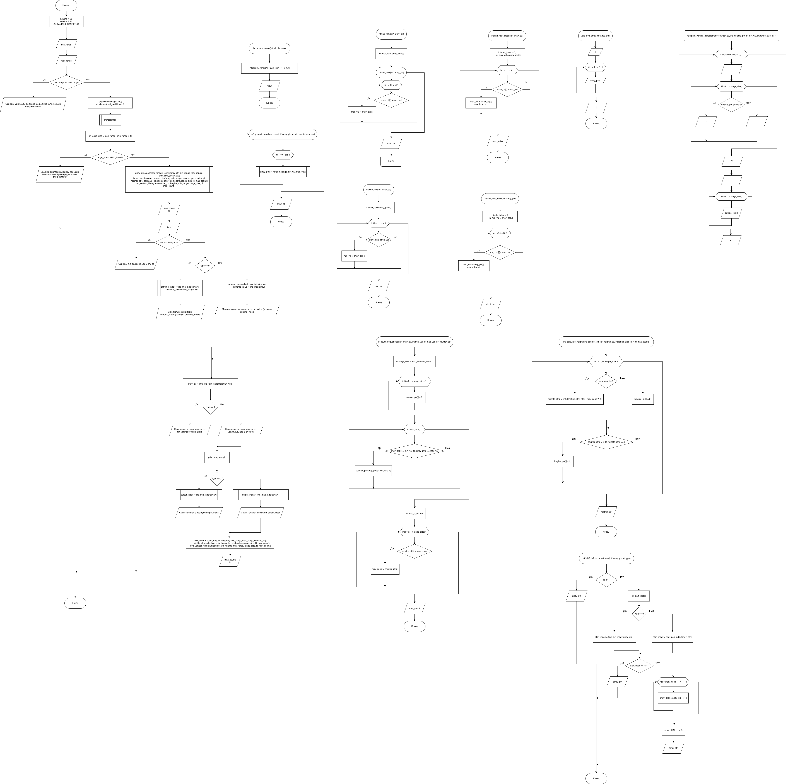

# Домашнее задание к работе 25

  

## Условие задачи
##### Оцените генерируемую последовательность чисел путем построение гистограммы частоты выпадания значений.
1. Для рассчета частоты встречаемости значений объявите массив счетчиков из K элементов, соотвествующих числу оценок и заполните его нулевыми значениями:

`int counter[K]={0, 0 };`

2. Сгенерируйте массив N случайных чисел array[N] в диапазоне от 1 до K c использованием ранее разработанных функций
3. Для получения оценки перебрать все элементы массива и увеличить счетчик, соотвествующий текущему значению:

`counter[array[i]]++;`

4. Результат отразить в виде вертикальной гистограммы, каждая строка которой состоит из *, равных нормированному значению получаемого из соотвествующего счетчика:

`x=counter[i]/counter[nmax]*R`, где R - максимально возможно число выводимых символов 

5*.Измените программу так. чтобы можно было задавать произвольный интервал генерируемых случайных числе и проводить оценку по сдвигу влево элементов от минимального/максимального значения (определяется
параметром type).

---

## 1. Алгоритм и блок-схема

  

### Алгоритм

1. Начало

2. Определяются константы в виде директив: N=20, R=20, MAX_RANGE=100
3. Ввод минимального и максимального значения диапазона
4. Проверка корректности введённого диапазона
5. Инициализация генератора случайных чисел
6. Создание массива из N элементов со случайными значениями в заданном диапазоне
7. Вывод исходного массива
8. Подсчёт частот: для каждого значения в массиве с помощью функции `count_frequencies`
	```c
	int count_frequencies(int * array_ptr, int min_val, int max_val, int * counter_ptr)

	{

	    int range_size = max_val - min_val + 1;


	    // Обнуляем счетчики

	    for (int i = 0; i < range_size; i++)

	    {

	        counter_ptr[i] = 0;

	    }


	    // Подсчитываем частоты

	    for (int i = 0; i < N; i++)

	    {

	        if (array_ptr[i] >= min_val && array_ptr[i] <= max_val)

	        {

	            counter_ptr[array_ptr[i] - min_val]++;

	        }

	    }


	    // Находим максимальную частоту

	    int max_count = 0;

	    for (int i = 0; i < range_size; i++)

	    {

	        if (counter_ptr[i] > max_count)

	        {

	            max_count = counter_ptr[i];

	        }

	    }

	    return max_count; // максимальная частота

	}
	```
	1. Создание массива счётчиков для каждого диапазона
	2. Подсчёт количества вхождений каждого значения
	3. Нахождение максимальной частоты
9. Вычисление высот столбцов(высота каждого столбца рассчитывается пропорционально его частоте, масштабируя к максимальной высоте R) с помощью функции `calculate_heights`
	```c
	int * calculate_heights(int * counter_ptr, int * heights_ptr, int range_size, int r, int max_count)

	{

	    for (int i = 0; i < range_size; i++)

	    {

	        if (max_count > 0)

	        {

	            heights_ptr[i] = (int)((float) counter_ptr[i] / max_count * r);

	        } else

	        {

	            heights_ptr[i] = 0;

	        }

	        // Гарантируем хотя бы один символ для ненулевых значений

	        if (counter_ptr[i] > 0 && heights_ptr[i] == 0)

	        {

	            heights_ptr[i] = 1;

	        }

	    }

	    return heights_ptr;

	}
	```
	1. Преобразование частот в высоты столбцов (0-R)
	2. Проверка, что ненулевые значения имеют высоту хотя бы 1
10. Отрисовка гистограммы: вывод вертикальной гистограммы, где:
	1. Высота столбцов отображается символами "*"
	2. По оси X указываются значения и их частоты в формате "значение (частота)"
11. Вывод максимальной частоты
12. Вывод максимальной высоты столбца в гистограмме (в символах)
13. Выбор типа преобразования:
	1. 0 - сдвиг от минимального элемента
	2. 1 - сдвиг от максимального элемента
14. Нахождение выбранного максимального/ минимального элемента и его позиция
15. Выполнение сдвига элементов влево, начиная с позиции максимального/ минимального элемента с помощью функции `shift_left_from_extreme`
	```c
	int * shift_left_from_extreme(int * array_ptr, int type)

	{

	    if (N <= 1)

	        return array_ptr;


	    int start_index;


	    // Определение стартового индекса в зависимости от типа

	    if (type == 0)

	    {

	        start_index = find_min_index(array_ptr);

	    } else

	    {

	        start_index = find_max_index(array_ptr);

	    }


	    // Если стартовый индекс последний, сдвиг не нужен

	    if (start_index >= N - 1)

	        return array_ptr;


	    // Сдвиг элементов влево начиная со стартового индекса

	    for (int i = start_index; i < N - 1; i++)

	    {

	        array_ptr[i] = array_ptr[i + 1];

	    }


	    // Последний элемент обнуляем

	    array_ptr[N - 1] = 0;

	    return array_ptr;

	}
	```
	1. Нахождение позиции минимального/максимального элемента
	2. Сдвиг всех элементов влево на одну позицию, начиная с позиции минимального/максимального элемента
	3. Обнуление последнего элемента
	4. Возврат указателя на изменённый массив
16. Вывод преобразованного массива
17. Вывод позиции, с которой начался сдвиг
18. Построение гистограммы для преобразованного массива
19. Вывод максимальной частоты
20. Вывод максимальной высоты столбца в гистограмме (в символах)
21. Конец
### Блок-схема



[Ссылка на draw.io](https://viewer.diagrams.net/?tags=%7B%7D&lightbox=1&highlight=0000ff&edit=_blank&layers=1&nav=1&title=%D0%94%D0%97%20%E2%84%9625.drawio&dark=auto#Uhttps%3A%2F%2Fdrive.google.com%2Fuc%3Fid%3D1PB6tP7Ewa5ngm-UJ1yu8RSdNh6kW6Tsx%26export%3Ddownload)

---

## 2. Реализация программы

```c
#include <stdio.h>

#include <stdlib.h>

#include <time.h>

#include <locale.h>


#define N 20

#define R 20

#defin e MAX_RANGE 100


// Функция для генерации случайного числа в диапазоне от min до max

int random_range(int min, int max)

{

    int result = rand() % (max - min + 1) + min;

    return result;

}


// Функция для генерации массива случайных чисел

int * generate_random_array(int * array_ptr, int min_val, int max_val)

{

    for (int i = 0; i < N; i++)

    {

        array_ptr[i] = random_range(min_val, max_val);

    }

    return array_ptr;

}


// Функция для нахождения максимального значения в массиве

int find_max(int * array_ptr)

{

    int max_val = array_ptr[0];

    for (int i = 1; i < N; i++)

    {

        if (array_ptr[i] > max_val)

        {

            max_val = array_ptr[i];

        }

    }

    return max_val;

}


// Функция для нахождения минимального значения в массиве

int find_min(int * array_ptr)

{

    int min_val = array_ptr[0];

    for (int i = 1; i < N; i++)

    {

        if (array_ptr[i] < min_val)

        {

            min_val = array_ptr[i];

        }

    }

    return min_val;

}


// Функция для нахождения индекса максимального значения

int find_max_index(int * array_ptr)

{

    int max_index = 0;

    int max_val = array_ptr[0];

    for (int i = 1; i < N; i++)

    {

        if (array_ptr[i] > max_val)

        {

            max_val = array_ptr[i];

            max_index = i;

        }

    }

    return max_index;

}


// Функция для нахождения индекса минимального значения

int find_min_index(int * array_ptr)

{

    int min_index = 0;

    int min_val = array_ptr[0];

    for (int i = 1; i < N; i++)

    {

        if (array_ptr[i] < min_val)

        {

            min_val = array_ptr[i];

            min_index = i;

        }

    }

    return min_index;

}


// Функция для подсчета частот

int count_frequencies(int * array_ptr, int min_val, int max_val, int * counter_ptr)

{

    int range_size = max_val - min_val + 1;


    // Обнуляем счетчики

    for (int i = 0; i < range_size; i++)

    {

        counter_ptr[i] = 0;

    }


    // Подсчитываем частоты

    for (int i = 0; i < N; i++)

    {

        if (array_ptr[i] >= min_val && array_ptr[i] <= max_val)

        {

            counter_ptr[array_ptr[i] - min_val]++;

        }

    }


    // Находим максимальную частоту

    int max_count = 0;

    for (int i = 0; i < range_size; i++)

    {

        if (counter_ptr[i] > max_count)

        {

            max_count = counter_ptr[i];

        }

    }

    return max_count; // максимальная частота

}


// Функция для вычисления высот столбцов гистограммы

int * calculate_heights(int * counter_ptr, int * heights_ptr, int range_size, int r, int max_count)

{

    for (int i = 0; i < range_size; i++)

    {

        if (max_count > 0)

        {

            heights_ptr[i] = (int)((float) counter_ptr[i] / max_count * r);

        } else

        {

            heights_ptr[i] = 0;

        }

        // Гарантируем хотя бы один символ для ненулевых значений

        if (counter_ptr[i] > 0 && heights_ptr[i] == 0)

        {

            heights_ptr[i] = 1;

        }

    }

    return heights_ptr;

}


int * shift_left_from_extreme(int * array_ptr, int type)

{

    if (N <= 1)

        return array_ptr;


    int start_index;


    // Определение стартового индекса в зависимости от типа

    if (type == 0)

    {

        start_index = find_min_index(array_ptr);

    } else

    {

        start_index = find_max_index(array_ptr);

    }


    // Если стартовый индекс последний, сдвиг не нужен

    if (start_index >= N - 1)

        return array_ptr;


    // Сдвиг элементов влево начиная со стартового индекса

    for (int i = start_index; i < N - 1; i++)

    {

        array_ptr[i] = array_ptr[i + 1];

    }


    // Последний элемент обнуляем

    array_ptr[N - 1] = 0;

    return array_ptr;

}


void print_array(int * array_ptr)

{

    printf("[");

    for (int i = 0; i < N; i++)

    {

        printf(" %d ", array_ptr[i]);

    }

    printf("]\n");

}


void print_vertical_histogram(int * counter_ptr, int * heights_ptr, int min_val, int range_size, int r)

{

    // Рисуем гистограмму сверху вниз

    for (int level = r; level > 0; level--)

    {

        printf(" ");

        for (int i = 0; i < range_size; i++)

        {

            if (heights_ptr[i] >= level)

            {

                printf(" * ");

            } else

            {

                printf(" ");

            }

        }

        printf("\n");

    }


    // Рисуем ось X с значениями

    printf(" ");

    for (int i = 0; i < range_size; i++)

    {

        printf("%2d ", i + min_val);

    }

    printf("\n");


    // Рисуем ось X с частотами

    printf(" ");

    for (int i = 0; i < range_size; i++)

    {

        printf("(%d) ", counter_ptr[i]);

    }

    printf("\n");

}


int main()

{

    setlocale(LC_ALL, "RUS");

    /* объявление необходимых переменных */

    int min_range, max_range;

    int array[N];

    int * array_ptr = & array;

    int counter_ptr[MAX_RANGE];

    int heights[MAX_RANGE];

    int * heights_ptr = & heights;

    int extreme_index, extreme_value;

    int type;

    int output_index;


    printf("Введите минимальное значение диапазона: ");

    scanf("%d", & min_range);

    printf("Введите максимальное значение диапазона: ");

    scanf("%d", & max_range);


    // Проверка корректности диапазона

    if (min_range >= max_range)

    {

        printf("Ошибка: минимальное значение должно быть меньше максимального!\n");

        return 1;

    }


    /* получает текущее календарное время */

    long ltime = time(NULL);

    /* преобразование его к типу int */

    int stime = (unsigned) ltime / 2;

    /* инициализация генератора */

    srand(stime);


    int range_size = max_range - min_range + 1;

    if (range_size > MAX_RANGE)

    {

        printf("Ошибка: диапазон слишком большой! Максимальный размер диапазона: %d\n", MAX_RANGE);

        return 1;

    }


    printf("\nПараметры: N=%d, Диапазон=[%d,%d], R=%d\n", N, min_range, max_range, R);


    array_ptr = generate_random_array(array, min_range, max_range);


    printf("\nИсходный массив: ");

    print_array(array);


    int max_count = count_frequencies(array, min_range, max_range, counter_ptr);

    // Вычисляем высоты всех столбцов

    heights_ptr = calculate_heights(counter_ptr, heights, range_size, R, max_count);

    printf("\n\n");

    print_vertical_histogram(counter_ptr, heights, min_range, range_size, R);

    printf("Максимальная частота: %d\n", max_count);

    printf("Максимальная высота столбца: %d символов\n", R);

    printf("Сдвиг влево элементов от минимального/максимального значения\n");


    printf("Выберите тип преобразования (0 - от минимального, 1 - от максимального): ");

    scanf("%d", & type);


    if (type != 0 && type != 1)

    {

        printf("Ошибка: тип должен быть 0 или 1!\n");

        return 1;

    }


    if (type == 0)

    {

        extreme_index = find_min_index(array);

        extreme_value = find_min(array);

        printf("Минимальное значение: %d (позиция %d)\n", extreme_value, extreme_index);

    } else

    {

        extreme_index = find_max_index(array);

        extreme_value = find_max(array);

        printf("Максимальное значение: %d (позиция %d)\n", extreme_value, extreme_index);

    }


    array_ptr = shift_left_from_extreme(array, type);


    if (type == 0)

    {

        printf("\nМассив после сдвига влево от минимального значения:\n");

    } else

    {

        printf("\nМассив после сдвига влево от максимального значения:\n");

    }

    print_array(array);

    if (type == 0)

    {

        output_index = find_min_index(array);

        printf("Сдвиг начался с позиции: %d\n", output_index);

    } else

    {

        output_index = find_max_index(array);

        printf("Сдвиг начался с позиции: %d\n", output_index);

    }


    printf("\nПосле преобразования:\n");


    max_count = count_frequencies(array, min_range, max_range, counter_ptr);

    heights_ptr = calculate_heights(counter_ptr, heights, range_size, R, max_count);

    print_vertical_histogram(counter_ptr, heights, min_range, range_size, R);

    printf("Максимальная частота: %d\n", max_count);

    printf("Максимальная высота столбца: %d символов\n", R);

    return 0;

}
```

  

# 3. Результаты работы программы

```bash
Введите минимальное значение диапазона: 0
Введите максимальное значение диапазона: 10

Параметры: N=20, Диапазон=[0,10], R=20

Исходный массив: [ 1  1  8  10  8  10  9  7  7  7  1  8  9  7  1  8  3  10  6  2 ]


         *                       *   *          
         *                       *   *          
         *                       *   *          
         *                       *   *          
         *                       *   *          
         *                       *   *       *  
         *                       *   *       *  
         *                       *   *       *  
         *                       *   *       *  
         *                       *   *       *  
         *                       *   *   *   *  
         *                       *   *   *   *  
         *                       *   *   *   *  
         *                       *   *   *   *  
         *                       *   *   *   *  
         *   *   *           *   *   *   *   *  
         *   *   *           *   *   *   *   *  
         *   *   *           *   *   *   *   *  
         *   *   *           *   *   *   *   *  
         *   *   *           *   *   *   *   *  
     0   1   2   3   4   5   6   7   8   9  10  
    (0) (4) (1) (1) (0) (0) (1) (4) (4) (2) (3) 
Максимальная частота: 4
Максимальная высота столбца: 20 символов
Сдвиг влево элементов от минимального/максимального значения
Выберите тип преобразования (0 - от минимального, 1 - от максимального): 0
Минимальное значение: 1 (позиция 0)

Массив после сдвига влево от минимального значения:
[ 1  8  10  8  10  9  7  7  7  1  8  9  7  1  8  3  10  6  2  0 ]
Сдвиг начался с позиции: 19

После преобразования:
                                 *   *          
                                 *   *          
                                 *   *          
                                 *   *          
                                 *   *          
         *                       *   *       *  
         *                       *   *       *  
         *                       *   *       *  
         *                       *   *       *  
         *                       *   *       *  
         *                       *   *   *   *  
         *                       *   *   *   *  
         *                       *   *   *   *  
         *                       *   *   *   *  
         *                       *   *   *   *  
     *   *   *   *           *   *   *   *   *  
     *   *   *   *           *   *   *   *   *  
     *   *   *   *           *   *   *   *   *  
     *   *   *   *           *   *   *   *   *  
     *   *   *   *           *   *   *   *   *  
     0   1   2   3   4   5   6   7   8   9  10  
    (1) (3) (1) (1) (0) (0) (1) (4) (4) (2) (3) 
Максимальная частота: 4
Максимальная высота столбца: 20 символов
```

# 4. Информация о разработчике

#### Сафонов Павел Романович бИПТ-251